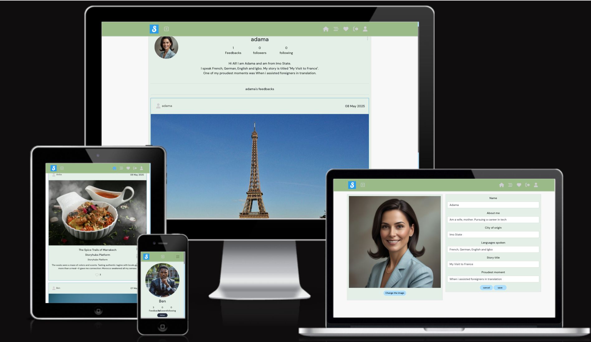
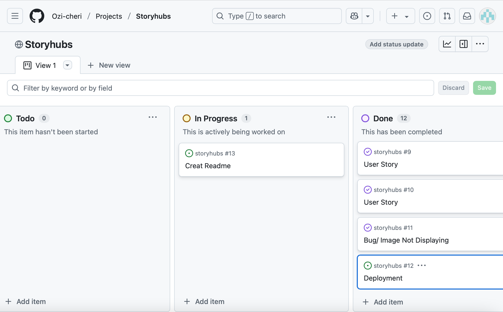
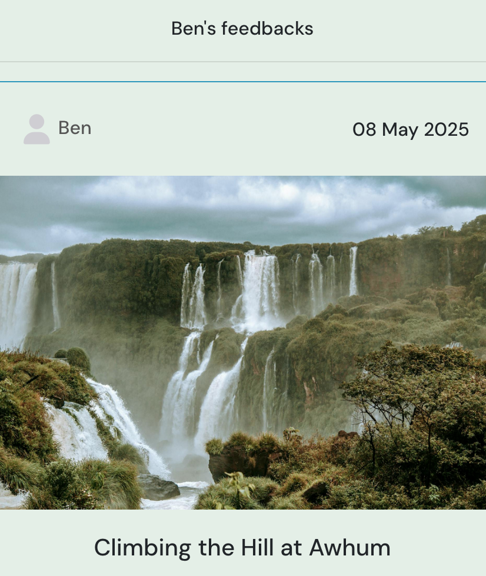
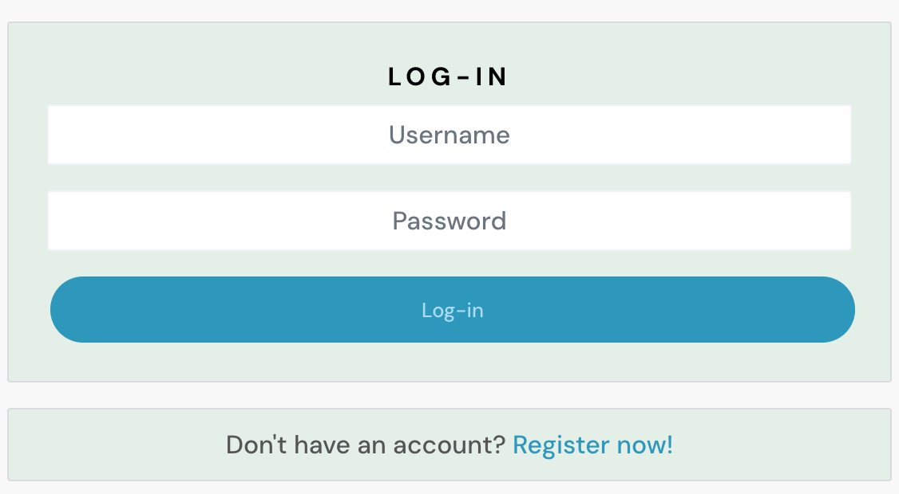
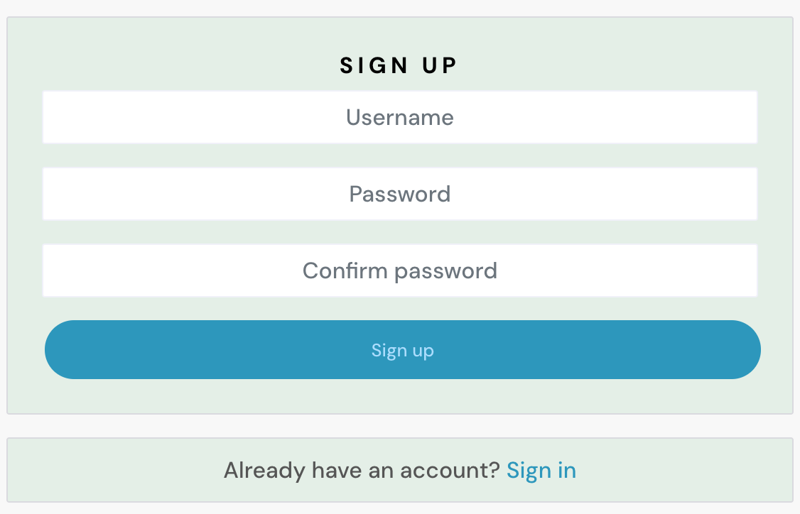
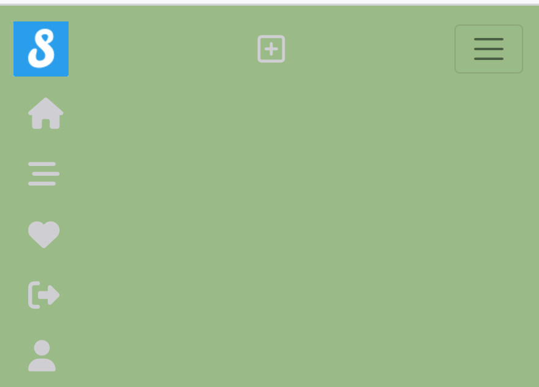
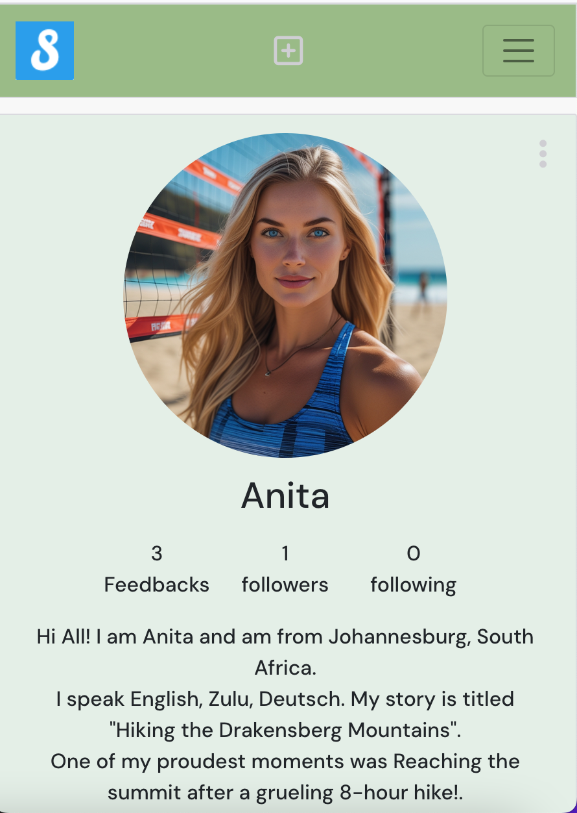
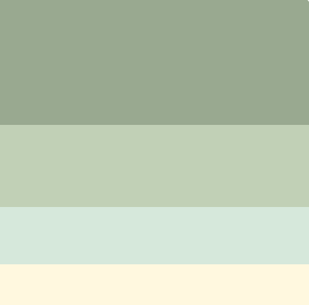

#  Storyhubs Frontend
Welcome to the frontend of **Storyhubs** – a user-generated storytelling platform that allows individuals to share life experiences, travel stories, and inspirational moments from around the world.

This is the **React.application** frontend that communicates with the **Django Rest Framework** backend. The backend repository which is called storyhubs-api can be found [here](https://github.com/Ozi-cheri/storyhubs-api). It supports image uploads via **Cloudinary**, displays user feedback stories, and includes a responsive layout.

##  Frontend Live Site

The live site can be found [here](https://storyhubs-7a570d7437c8.herokuapp.com/).

## Project Overview

Storyhubs allows users to:

- Sign up, log in, and manage their profiles.
- Creates stories.
- Follow and Like feedbacks.
- Upload stories with images, categorized by theme (e.g. travel, culture, personal growth).
- View stories shared by others on the home page.
- Interact with a clean, mobile-friendly UI.

## Agile methodology

* This project follows Agile development principles, focusing on iterative development and regular feedback.  The project was managed using GitHub Projects, where user stories were created and tracked as issues.

### Tools Used For Agile development

GitHub Projects for tracking sprints and issues

GitHub Issues for writing user stories with clear acceptance criteria

Commits linked to issues for traceability and progress updates

The project board can be found [here](https://github.com/users/ozi-cheri/projects/9)

[Back to Top](#)

## Existing Features

#### Navigation

This contains links to Home,Signup, Log in, 

- The homepage displays users uploads

- Log In
Users can login here if they already have an account.

- Signup
New users are expected to sign up before they could access the site.

### Profile Page

Once signup or logged in, users have access to a profile form where they can upload or update Profile pictures
 or personal descriptions as well as other features in the app.

 

### New Feedback

There are buttons for New Feedback where users can write feedbacks about their stories and upload their image.

[Back to Top](#)

### Edit & Delete Options (3-Dots Menu)
Each post or feedback includes a three-dots icon (`⋯`) giving access to:

- Edit: Opens the form pre-filled with the original content for quick updates.
- Delete: Prompts a confirmation before removing the content.

These buttons are only visible to the content owner of the page 

### Follow/Unfollow Page

- Users can **follow** or **unfollow** others by visiting their profiles.

- Follower/following counts are dynamically displayed and you can unfollow a user by clicking the button again and vice versa.
  

## Feature Improvements 

* Users will be able to comment on feedbacks and engage in discussion.

* Allow filtering feedbacks by location, category, or language.

* Notify users when someone follows or interacts with their stories.

* Award badges based on activity or story themes.

* Add search icon to search story.

* Add comment form for users.

## Languages

- HTML
- CSS
- Bootstrap
- React

## Libraries used

- React is a JavaScript library used to build the user interface. 
- React-Bootstrap was used to provide pre-built, responsive components.
- Axios handled API requests between the React frontend and the Django REST API, allowing the Front-end to communicate with the Back-end.
- React Router Dom was used for managing routing and navigation between different pages within the React frontend.

## Technologies used
- [GitHub](https://github.com/) was used to host the repository and as version control.

- [Heroku](https://www.heroku.com/) was used to deploy the frontend of the project.

- [Leonardo Ai](https://app.leonardo.ai/) was used to created the profile photos.

- [Visit Pexels – Free Stock Photos & Videos](https://www.pexels.com) was used to create images.

- [FontAwesome](https://fontawesome.com/) was used to choose icons for the NavBar.

## User Stories

* As a first time user, i want to create an account in order to access the site and start posting my own stories.

* As a user, I want to view a list of stories on the homepage so I can browse what others have shared.

* As a user, I have my profile page where I can display information about myself.

* As a logged in user, i can easily visit the site using log-in button displayed at the navigation bar.

* As a user, I can create my own stories feedback about my life experience to share my views with the platform.

* As a user logged in user, I can view others feedback.
- As a user, i can edit my profile or my stories and even delete as well so I can manage what I share.

* As a user, i can follow and like my favourite profile so i can motivate them especially if they have interesting stories.
* As a user, I want to be able to post a new story so I can share my experience.

* As a user, I want the site to be fully responsive so I can use it on any device.

* As a user, I want to view error messages clearly when something goes wrong.

[Back to Top](#)

### Wireframes 

### User experience(UX)

* The project follows a clean and modern layout for easy navigation.

* Pages are responsive and work well on mobile, tablet, and desktop devices.

* Buttons, links, and forms have intuitive placements and clear labels.

* Color choices ensure readability and a calm visual feel (#ADF, #2596be, #E4EFE7, #99bc85).

* Consistent typography is applied using the DM Sans font for a clean and professional look.

* Feedback messages and loading states guide users through actions like logging in, posting stories, or updating profiles.

* Interactive elements such as "likes", "follows", and "3-dots" edit/delete menus make the experience engaging.

* Accessibility best practices were followed to ensure usability for all users.

### Colour scheme

Each color was chosen to promote a clean and calm visual hierarchy, improving accessibility and user experience.

### Typography

The project uses the DM Sans font family for clean and modern text styling. This font is loaded from Google Fonts and supports weights of 500 (Medium) and 700 (Bold) for consistent heading and body text styling.

### Testing

Please click [TESTING.md](TESTING.md)file for all testing.

### Deployment
1. Log in Or Sign up to your Heroku account.
2. Click New to Create new app.
3. Choose an app name and choose the closest region and click on create app.
4. Go to the Heroku app Dashboard.
5. Click the 'Deploy' tab.
6. In the Deployment method section, click Connect to GitHub.
7. Search for the repo you want to connect and click Connect.
8. Select  manual deploy section and wait for few minutes for your app to go through the process of deployment.
9. Your app is deployed. You can find it in *** Open app ***.

### Local Clone

* Sign up or log in on Github
* Click "code" button and copy the provided link.
* Enter git clone in the terminal,paste the link and run it.
* git clone https://github.com/ozi-cheri/storyhubs.git

### Forking The Github Repository

* Locate the Github log inrepository
* Click the "fork" button at the the right top corner of the page.

## Credits

Code Institute walkthrough video was used to create this project.

## Acknowledgements 

* Code institute for the platform.
* My Mentor Gareth McGirr for his supports and feedbacks.

[Back to Top](#)

