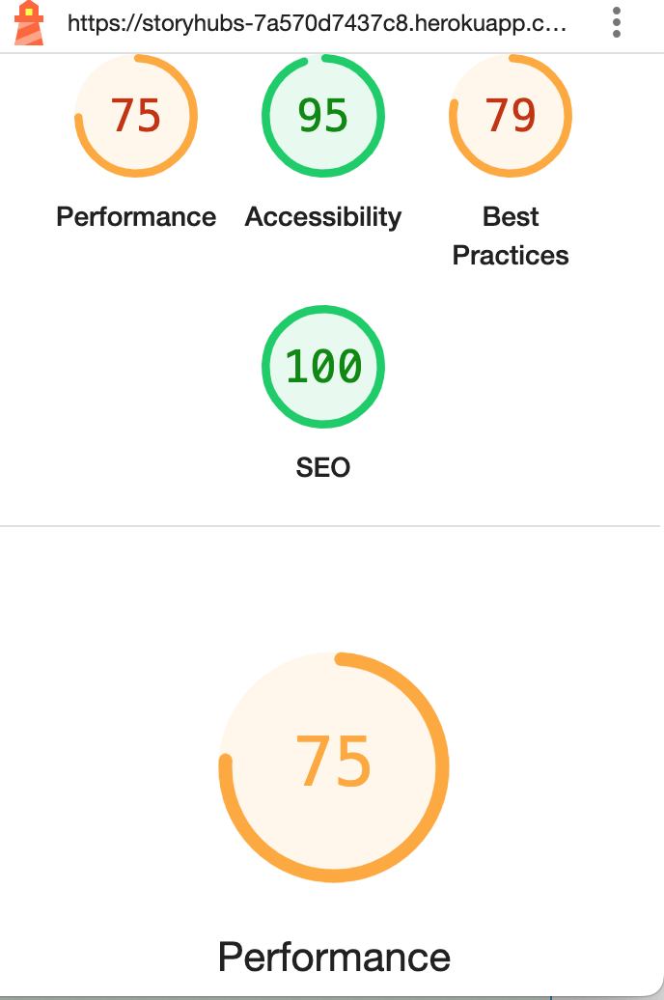
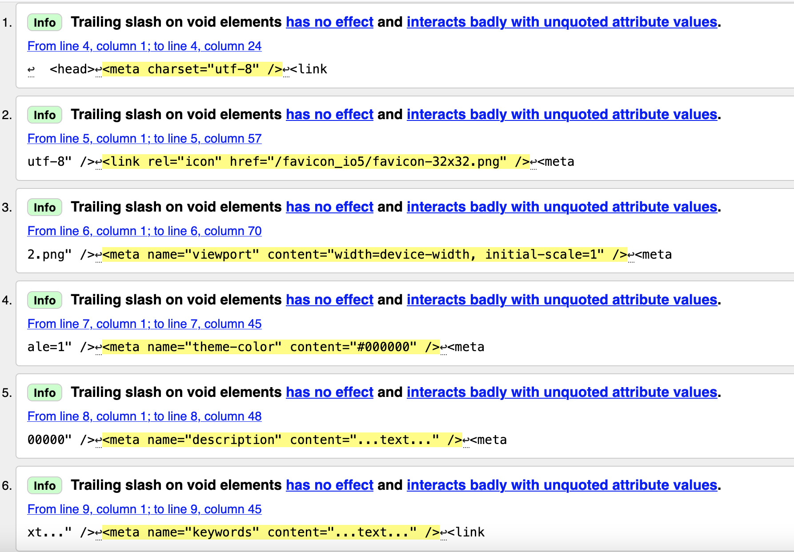

# TESTING.md

* Kindly navigate back to README.md with this link [⬅ Back to README](README.md)

## Table of Contents
- [Manual Testing](#manual-testing)
- [Responsive Design Testing](#responsive-design-testing)
- [Browser Compatibility](#browser-compatibility)
- [Validation Testing](#validation-testing)
- [Known Issues](#known-issues)

### Manual Testing

| Feature          | Action                              | Expected Result               |  Status|
|------------------|-------------------------------------|-------------------------------|--------|
| Sign Up          | Fill and submit form                | Account created               | ✅     |
| Login            | Enter credentials and login         | User logged in                | ✅     |
| Create Story     | Fill form and submit                | Story visible                 | ✅     |
| Edit Story       | Edit and save changes               | Story updated                 | ✅     |
| Delete Story     | Delete post via menu                | Story removed                 | ✅     |
|                  |                                     |                               |
| Follow User      | Click follow on profile             | User followed                 | ✅     |
| Like Story       | Click heart icon                    | Like count increases          | ✅     |
| Upload Picture   | Upload and save new photo           | Image displays                | ✅     |
| View story       | Click post title or image           | Post details open             | ✅     |

### Responsive Design Testing

| Device              | Model              | Screen Size / Resolution  | Test Result      |
|---------------------|--------------------|---------------------------|------------------|
| Mobile              | iPhone 13          | 390 x 844                 | ✅ Passed        |
| Mobile              | iPhone XR          | 414 x 896                 | ✅ Passed        |
| Mobile              | iPhone 16 Pro Max  | 430 x 932 (est.)          | ✅ Passed        |
| Tablet              | iPad               | 768 x 1024                | ✅ Passed        |
| Laptop/Desktop      | MacBook Pro (13")  | 1440 x 900                | ✅ Passed        |
| Desktop             | Full HD Monitor    | 1920 x 1080               | ✅ Passed        |

### Browser Testing

| Browser          | Action Performed            | Expected Behavior           | Status |
|------------------|-----------------------------|-----------------------------|--------|
| Chrome           | Full site navigation        | All features work           | ✅     |
| Firefox          | Create/edit/delete story    | Functions as expected       | ✅     |
| Safari           | Sign up/login/logout        | Works without issues        | ✅     |
| Edge             | Image upload + display      | Uploads & shows correctly   | ✅     |
| Brave            | Post like/follow features   | Interactive features work   | ✅     |
| Mobile Chrome    | View and scroll             | Responsive & smooth         | ✅     |

### Lighthouse Testing Result

### Validation Testing

The css files were validated using [W3 Jigsaw validator](https://validator.w3.org/)

The index.html was validated using [W3C validator](https://validator.w3.org/)
It came back clear, but had some trailling slash

### Known Issues and Solutions

* Images not displaying after deployment                                   
* Profile picture not showing on refresh
* Failed to load resource: the server responded with a status of 401 (Unauthorized)Understand this error
storyhubs-api-4e038dae39bb.herokuapp.com/dj-rest-auth/token/refresh/:1.
                      
* Failed to load resource: the server responded with a status of 401 (Unauthorized)Understand this error
storyhubs-api-4e038dae39bb.herokuapp.com/dj-rest-auth/user/:1 .
            
            
* Failed to load resource: the server responded with a status of 401 (Unauthorized)Understand this error.

### Solution

My backend, storyhubs-api setting.py was modified to resolve this issue.

[Back to Top](#)